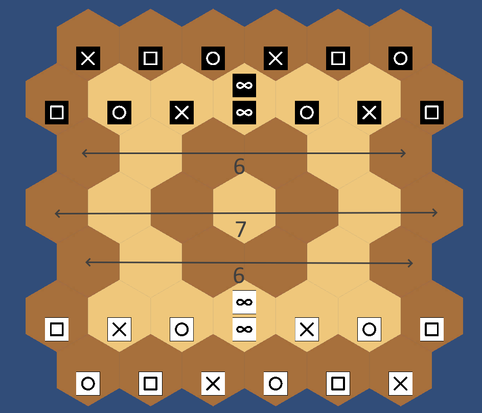
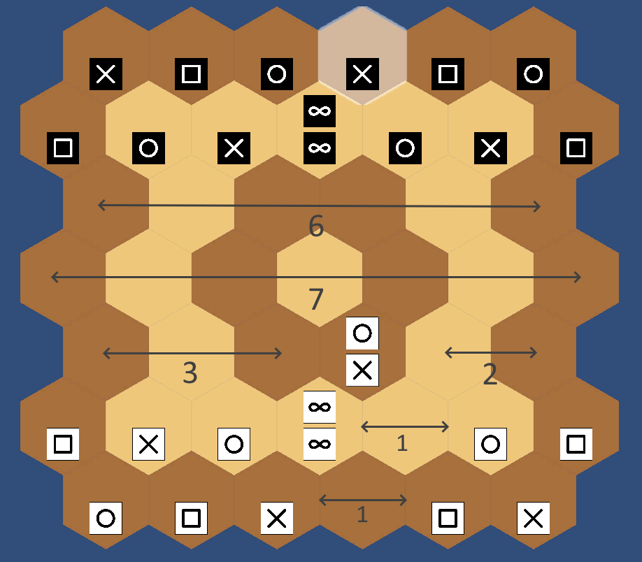

# Universal Game Interface (UGI)

Natural Selection can use the UGI protocol to communicate and play against other engines. This protocol is designed to be used with any sequential game.

An overview can be found here: [GitHub](https://github.com/kz04px/cutegames/blob/master/ugi.md)

The protocol is based on the UCI protocol for chess.

## Positions - Pijersi Standard Notation (PSN)

The Pijersi Standard Notation (PSN) notation is inspired by the Forsyth–Edwards Notation (FEN) in Chess ([Wikipedia](https://en.wikipedia.org/wiki/Forsyth–Edwards_Notation)).

A Pijersi position is represented by a string in the `[position] [additional info]` format.

### Pieces

The pieces are represented as such:
* Scissors : `S` or `s`
* Paper : `P` or `p`
* Rock : `R` or `r`
* Wise : `W` or `w`

White pieces are uppercase and black pieces are lowercase.

A single piece (without stack) is represented as `x-`. A stack is represented as `bt` where `b` is the bottom piece, and `t` is the top piece.

### Empty space

Empty space in the board is represented by a number equal to the number of empty cells between:
* Either the last non-empty cell or the beginning of the line
* Either the next non-empty cell or the end of the line

### Lines

The lines are separated by slashes (`/`). They are written from top to bottom. The pieces in each line are written from left to right.

### Additional information

The position word is followed by information about the current player, the half move counter, and the full move counter.

It takes the following form: `[player] [half move] [full move]`.

* The player info is either `w` or `b` depending on the player turn. For example, on white to play, the current player is `w`.
* The half move counter starts at 0 and is incremented at the end of every move, except if the move contains a capture, in which case the counter is reset to 0.
* The full move counter starts at 1 and is incremented at the end of the black turn.

### Examples

The starting position is represented as: `s-p-r-s-p-r-/p-r-s-wwr-s-p-/6/7/6/P-S-R-WWS-R-P-/R-P-S-R-P-S- w 0 1`



The below position (after move a4b5c4) is represented as: `s-p-r-s-p-r-/p-r-s-wwr-s-p-/6/7/3SR2/P-S-R-WW1R-P-/R-P-S-1P-S- b 1 1`



## Moves

Moves need to be represented a set of two or three coordinates.

Cells are indexed with :

* A lowercase letter that represents the line (from bottom to top): `a` to `g`
* A number that represents the column (from left to right): `1` to `6` or `1` to `7`

The number of coordinates depends on if the starting piece is a single piece or a stack.

If the starting piece is a single piece, and the action is a simple move or a simple stack, the move is represented by the starting and ending coordinates.

If the starting piece is a single piece and the action is stack-move, then the move is represented by the starting, middle, and ending coordinates.

If the starting piece is a stack, the move is represented by three sets of coordinates. The first coordinates represent the starting position. The second coordinates represent the position where the bottom piece is dropped. The third coordinates represent the position where the top piece is dropped.

In order to check if the move representation matches UGI, a list of all the starting moves can be found here: [Split Perft 1 results](data/doc/perftsplit_1_startpos.txt).

## Commands

An engine that implements UGI has to be able to respond to the following commands at minimum. There are extra commands that are unused for now.

For illustration purposes, requests will be prefixed with `>>>` and answers with `<<<`. **The actual engine should *NOT* use those prefixes**.

### `ugi`

This command is used to tell the engine to switch to UGI mode. This must be sent before any other command and replied to with `ugiok`. The engine will identify itself with the `id` command.

```
>>> ugi
<<< id name Natural-Selection
<<< id author Eclypse-Prime
<<< ugiok
```

### `isready`

This command can be sent at any time and must be replied to with `readyok` whenever the engine is ready. `isready` will be sent once after `ugi` before the engine is asked to search/etc. No large amounts of memory or other time expensive operations should be performed before the first isready is received.

```
>>> isready
[Perform expensive initializations here]
<<< readyok
```

### `uginewgame`

```
>>> uginewgame
[Reset the position to startpos]
```

### `quit`

```
>>> quit
[Closes the engine]
```

### `go`


This command orders the engine to search for the best move with the chosen time control.

The options that must be implemented are `depth` and `movetime`. Other options that exist but are not necessary are: `p1time [ms] p2time [ms] p1inc [ms] p2inc [ms]`, `nodes [nodes]`, `infinite`.

The engine indicates the search has finished with `bestmove [move string]`.

The engine is not required to apply the chosen move.

```
>>> go depth 2
[Search the best move at depth 2]
<<< info depth 1 time 0.054 pv a5b5d6
<<< info depth 2 time 0.349 pv a5b6d5
<<< bestmove a5b5d4
```
```
>>> go movetime 10
[Search the best move for 10 ms]
<<< info depth 1 time 0.046 pv a5b6d7
<<< info depth 2 time 2.282 pv a5b6d5
<<< info depth 3 time 0.748 pv a2b3c3
<<< bestmove a5b5d4
```

The `go manual` command has been implemented for convenience in Natural Selection. It is not standard.

```
>>> go manual [move]
[The engine plays the chosen move]
```

### `position`

```
>>> position startpos
```
```
>>> position fen [psn]
```
```
>>> position startpos moves [move list]
```
```
>>> position fen [psn] moves [move list]
```

### `query`

```
>>> query gameover
<<< response [true/false]
```
```
>>> query p1turn
<<< response [true/false]
```
```
>>> query result
<<< response [p1win/p2win/draw/none]
```

The following commands have been implemented for convenience in Natural Selection. They are not standard.

```
>>> query islegal [move]
<<< response [true/false]
```
```
>>> query fen
<<< response s-p-r-s-p-r-/p-r-s-wwr-s-p-/6/7/6/P-S-R-WWS-R-P-/R-P-S-R-P-S- w 0 1
```